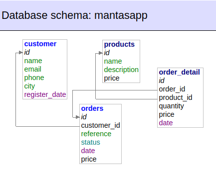
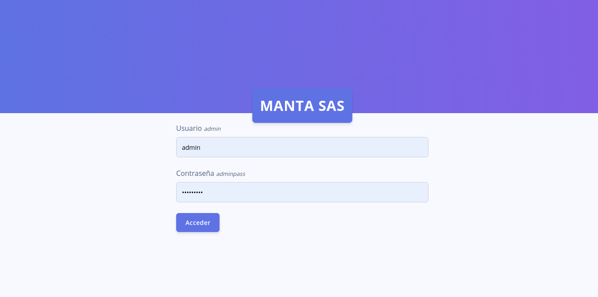
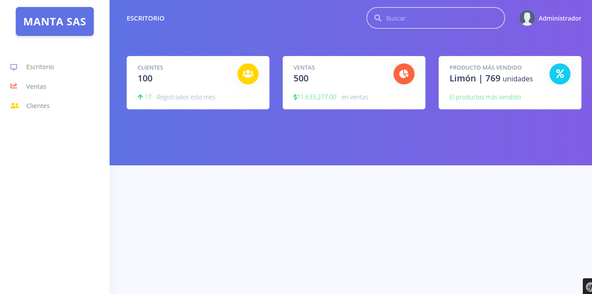
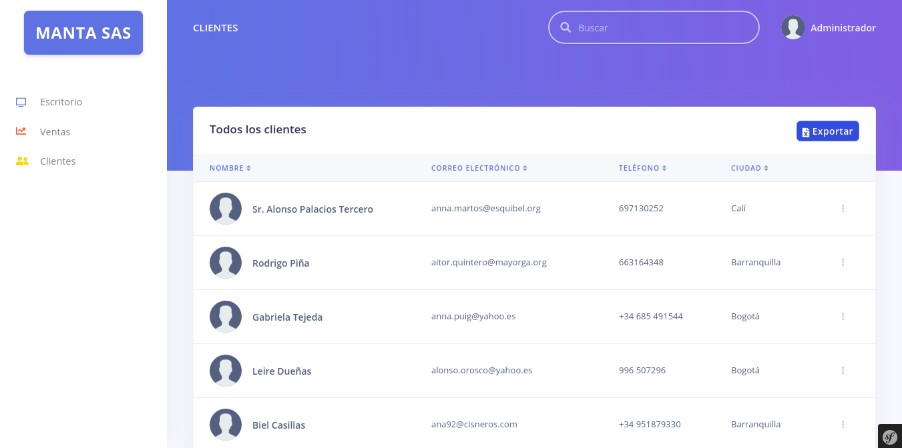
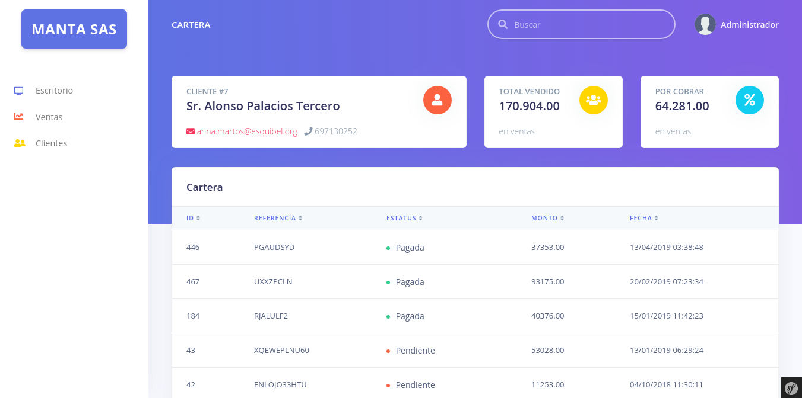
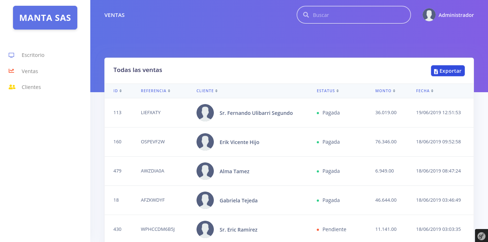

DEMO desarrollado en Symfony 3.0
========================

Instalación
--------------
Para instalar seguir los siguientes pasos:

Clonamos el proyecto
```
git clone 
```
Instalamos las dependencias
```
composer update 
```
Configurar base de aatos en el archivo app/config/parameters.yml
```
database_name: _mantasapp_
database_user: _root_
database_password: _password_
```
Creamos la base de datos del paso anterior
```
php bin/console doctrine:database:create
```
Generamos las tablas de la base de datos
```
php bin/console doctrine:schema:update --force
```
Cargamos los datos de prueba
```
php bin/console doctrine:fixtures:load
```
Ejecutamos el servidor local
```
php bin/console server:run
```
Esquema de la base de datos 
--------------



Screenshots 
--------------
#### LOGIN

#### DASHBOARD

#### CLIENTES

#### CARTERA

#### VENTAS
